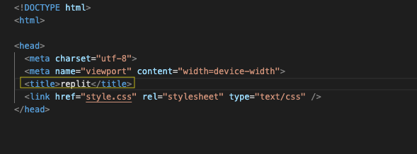

  
# Welcome to the HK docs
  

  
Here you will be able to find lots and lots of info regarding how to create your own HK documentation.

  
This project was developed from creativity ground up and for starters and is meant to be forked/copied on the Replit service and edited on your own from there. This is not a web page template with everything but this template is a starter guide in order to create your HK styled documentation. Just as a note, this template may seem a little messy, but in order to make sure everything is working correctly, this is the way we decided to keep the format. It is very important that you guys follow this template because all of the information and all the files that are here, work accordingly, so it is important that you don't touch anything other than what we say is ok in this tutorial. Please note that many of the html files have gone editing changes but the main real content should come from you guys as thats why you want to create a documentation! DO NOT EDIT ANY OF THE FILES IN THE "README" FOLDER!!!

  
So what are you waiting for? Lets get started!

## Editing index.html

  
For starters, lets start by clicking on the "index.html" file in your list of files. Then find the "title" attribute at the top. Next delete the text that says "replit" and then type in what you want your website tab to say for example, we would have put the tab title as "The HK docs" 

  
The image is listed below for what you should modify. 

  

