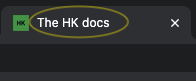
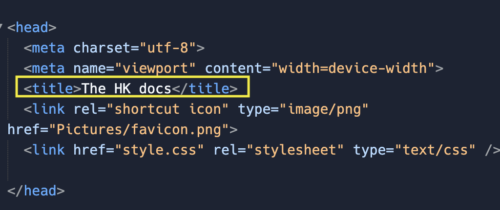
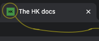
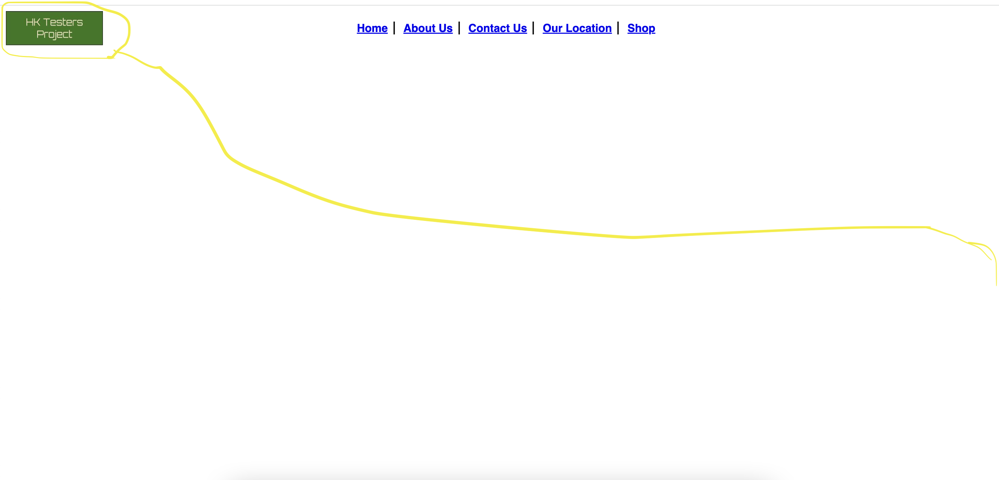
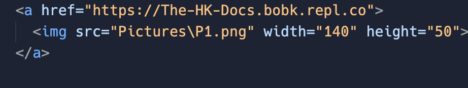
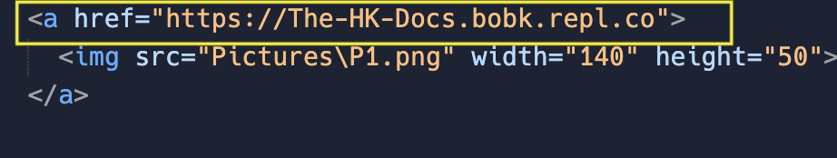

  
# Welcome to the HK docs

## Introduction

  
Here you will be able to find lots and lots of info regarding how to create your own HK documentation.

  
This project was developed from creativity ground up and is meant to be forked/copied on the Replit service and edited on your own from there. Please note that this template is mainly meant for you as a community member to write the main html pages by yourself as what we developed is just the outline. This is not a web page template with everything but this template is a starter guide in order to create your HK styled documentation. Just as a note, this template may seem a little messy, but in order to make sure everything is working correctly, this is the way we decided to keep the format. It is very important that you guys follow this template because all of the information and all the files that are here, work accordingly, so it is important that you don't touch anything other than what we say is ok in this tutorial. Please note that many of the html files have gone editing changes but the main real content should come from you guys as thats why you want to create a documentation! The best way to do your documentation correctly is by not touching any of the files not mentioned and editing the files that were mentioned and asked to be edited.

  
So what are you waiting for? Lets get started!

# Getting Started
If you are on <a href="https://replit.com" target="_blank">replit</a> and did not fork this repl yet: If you did not fork this repl then that means you are viewing the main page or introduction page of this repl. In that case, fork this repl and move on.

If you are viewing this README in the forked HK docs repl: If you are in this stage, you can just move on to "Editing index.html"

If you are viewing this README on Github: If you are over here, then you can (1.) locally install all the files to your computer in a code workspace and view the README file on Github, (2.) you can click <a href="https://replit.com/@bobk/The-HK-Docs?v=1#README.md" target="_blank">this replit link</a> to view the replit template and fork it, or (3.) you can directly edit this template in Github online and create a Github pages website!
## Editing index.html

### Tab Title

  
In this section of your index.html journey, we will start by changing the title of the tab. An example of a tab title is shown down below.

The "title" on the tab pictured below is named "The HK docs".

Pretty cool huh! Now, lets go ahead and have you change your title.

#### Creating your title:
  
For starters, lets start by clicking on the "index.html" file in your list of files. Then find the "title" attribute at the top. Next delete the text that says "The HK docs" and then type in what you want your website tab to say. 

  
The image is listed below for what you should modify. 

  

### Tab icon (favicon)

In this section of Editing index.html, you will be able to find out how to change the tab icon, widely known as the "favicon".

Here is an example of a favicon:

#### Changing the favicon

In order to change the favicon, you will preferrably need a square/circle looking png picture in order to sink in with the pre-written code. Once you have your image, make sure it is installed to your computer and upload the .png file to your programming workplace, if you are on replit, you would upload it to the replit file manager of this replit on the left, where it says "files". Once you go to your file manager of all the files in this template, open the "Pictures" folder and delete the file that says "favicon.png". Next, for any workplace, take your preffered .png favicon image and drop it into the "Pictures" folder of this template. After that rename your preffered favicon .png file to favicon.png. Refresh the tab and there you go, you can see your favicon image!

<a href="https://1drv.ms/v/s!AuOJcqLLBs2NhH2sGKQM0g9akB9S" target="_blank">Click here for a quick video on how to change your favicon!</a>

### Website banner

The website banner is the rectangular image on the top left of the webpage. An image is shown below of the Website banner of the HK docs template website.

#### Changing the website banner

In order to have your Website banner to appear, you need to find these lines of code pictured down below in the index.html file and find the lines of code pictured below.

Next, go to the "Pictures" folder of this code template and delete the P1.png picture file and upload your preffered website banner. Then rename your file to P1.png.

After that, we have to change the link of the banner image to match the link (domain) of your website/webpage to do that go find this specific line of code pictured below (It is part of the same lines of code pictured above). 

Once you find this line, change the link https://The-HK-Docs.bobk.repl.co to the domain or link of your website. The link can also be local file webpage, for example if someone created a home.html page, they would set the link as "home.html". Then whenever someone clicks the banner, it would take them to the home.html webpage  After that you should be able to be able to click your preffered baner image and it should take you back to your website or webpage.

## Editing further pages
The full tutorial is still being developed and will be added soon.

